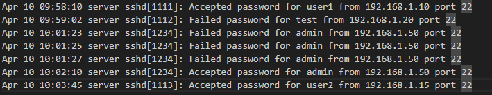

# SOC Labs - Raphael Orfali

Este repositório reúne estudos práticos em cibersegurança com foco em Blue Team, análise de logs e investigação inicial de incidentes.

## Lab 1 - Brute Force Detection Analysis

### Scenario
Este laboratório simula um caso de brute force contra uma conta com privilégio elevado em um servidor Linux exposto via SSH. O objetivo é analisar os eventos de autenticação, separar ruído de atividade suspeita e documentar a investigação como um caso de triagem inicial em SOC.

### Objective
Identificar se a sequência de autenticações observada indica tentativa de acesso não autorizado e justificar a classificação do incidente com base nos logs disponíveis.

### Key Findings
- Múltiplas falhas de autenticação via SSH para a conta `admin` em curto intervalo.
- Origem recorrente: `192.168.1.50`.
- Login bem-sucedido para a mesma conta após a sequência de falhas.
- Evidências compatíveis com brute force bem-sucedido e potencial comprometimento de credencial.

### Incident Summary
- Severity: High
- Status: Confirmed
- MITRE ATT&CK: `T1110 - Brute Force`
- Primary IOC: `192.168.1.50`
- Affected Account: `admin`
- Exposed Service: `SSH / port 22`

### Why This Lab Matters
Este caso demonstra competências importantes para funções de SOC/Blue Team:
- leitura e interpretação de logs
- montagem de timeline
- triagem inicial de alertas
- identificação de IOC
- classificação de incidente
- definição de contenção e mitigação

### Data Sources
- Arquivo de log analisado: [Logs.txt](Logs.txt)
- Evidência visual: `evidence.png`
- Relatório técnico completo: [incident-report.md](incident-report.md)

### Investigation Flow
1. Revisão do arquivo de autenticação para separar eventos benignos e suspeitos.
2. Identificação de repetição de falhas para a mesma conta e mesma origem.
3. Validação de sucesso de autenticação após tentativas consecutivas.
4. Classificação do incidente com base em IOC, timeline, impacto e técnica MITRE.
5. Definição de ações imediatas de contenção e fortalecimento de controle.

### Recommended Actions
- Bloquear ou isolar temporariamente o IP de origem no firewall.
- Resetar a senha da conta afetada.
- Habilitar MFA para acessos administrativos.
- Revisar exposição do serviço SSH e políticas de bloqueio por tentativas.
- Correlacionar esse IOC com outras fontes de log para verificar atividade lateral.

## Evidence

## Notes
Os logs deste repositório representam um cenário simulado para fins de estudo e prática em investigação de incidentes.
